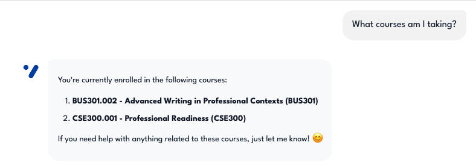
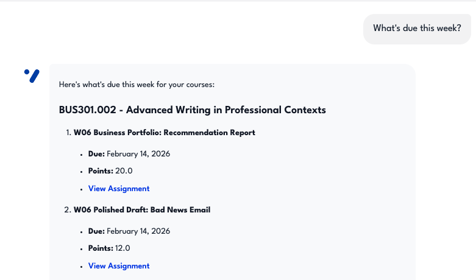
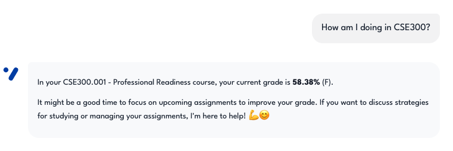
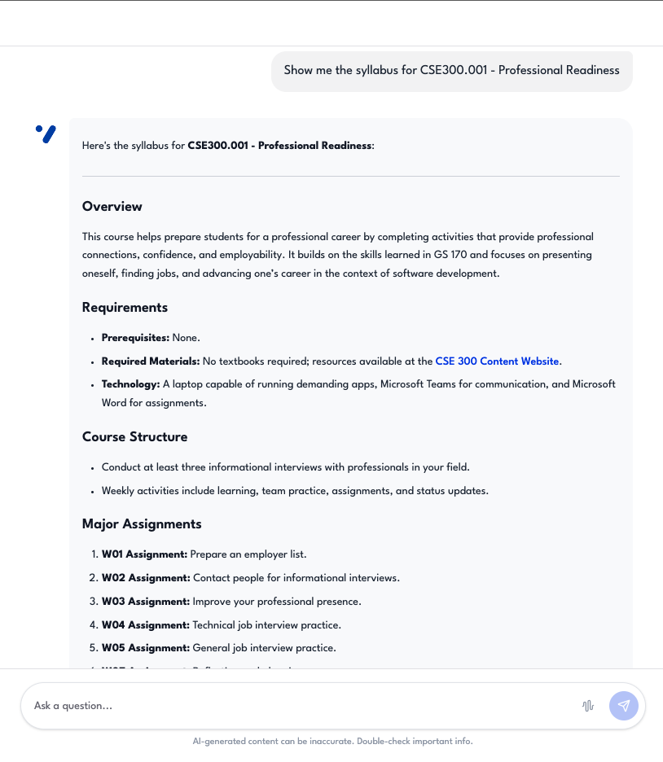
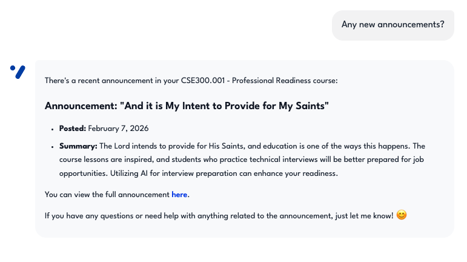
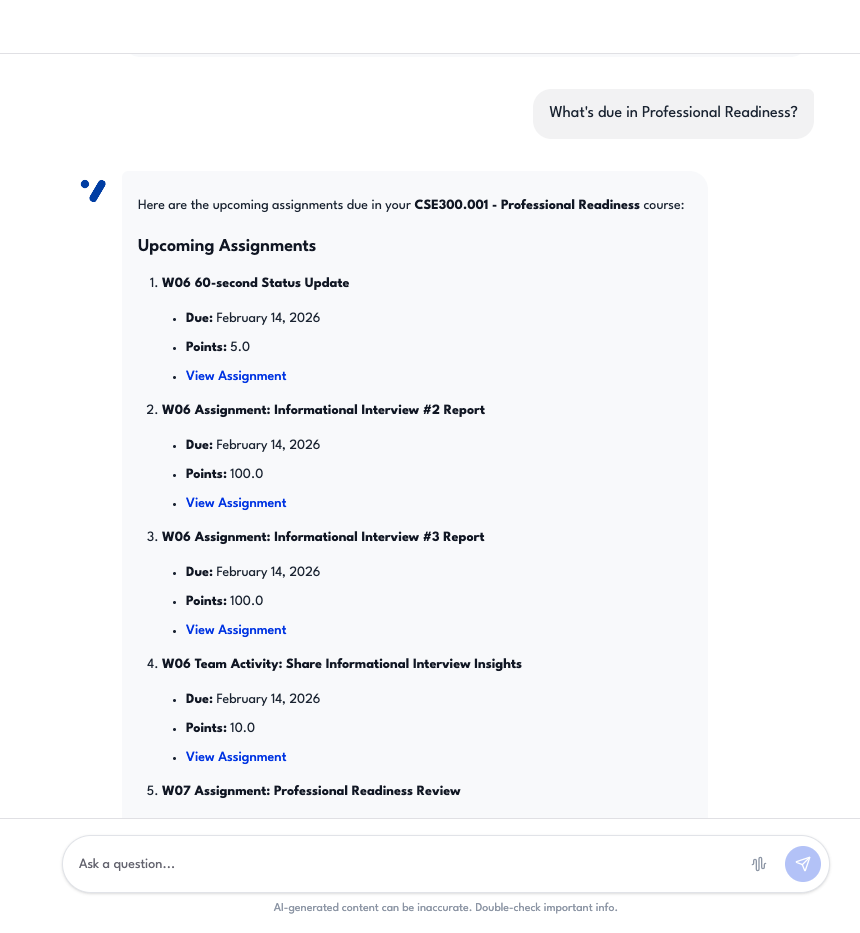
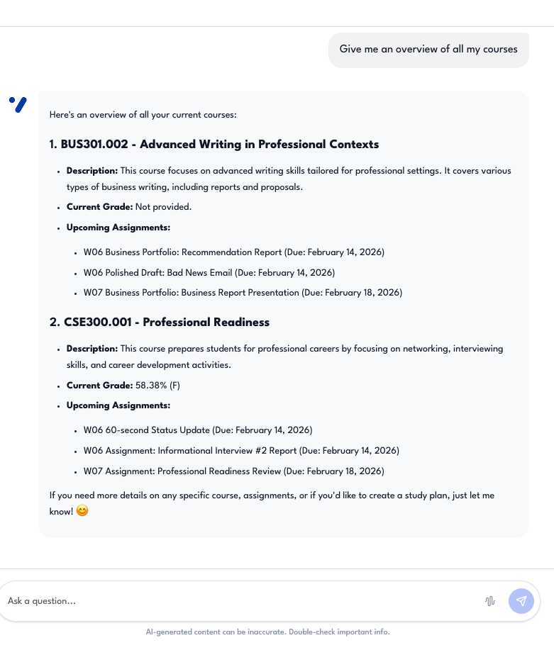

# Canvas LMS — Evidence Screenshots

Screenshots demonstrating Canvas LMS data queries through the assistant.  
These correspond to **Evaluation Plan §1.1 — Course Information Retrieval** (Test Cases #1–#7).

---

## Test Case #1 — List enrolled courses

**Description:** The assistant returns all active Canvas courses with names and codes.  
**Input:** `"What courses am I taking?"`  
**Expected:** Returns all active Canvas courses.

---

## Test Case #2 — Assignment lookup

**Description:** The assistant lists assignments with due dates sorted chronologically.  
**Input:** `"What's due this week?"`  
**Expected:** Lists assignments with due dates from Canvas.

---

## Test Case #3 — Grade retrieval

**Description:** The assistant returns current scores/grades for a specific course.  
**Input:** `"How am I doing in <course name>?"`  
**Expected:** Returns current grades/scores.

---

## Test Case #4 — Syllabus access

**Description:** The assistant returns formatted syllabus content from Canvas.  
**Input:** `"Show me the syllabus for <course name>"`  
**Expected:** Returns syllabus content from Canvas.

---

## Test Case #5 — Announcement query

**Description:** The assistant lists recent course announcements.  
**Input:** `"Any new announcements?"`  
**Expected:** Lists recent course announcements.

---

## Test Case #6 — Flexible course matching

**Description:** The assistant matches a course by partial name, not just course ID.  
**Input:** `"What's due in <course name>?"`  
**Expected:** Matches course by name, not just ID.

---

## Test Case #7 — Multi-course overview

**Description:** The assistant aggregates data across all enrolled courses.  
**Input:** `"Give me an overview of all my courses"`  
**Expected:** Aggregates data across all enrolled courses.

