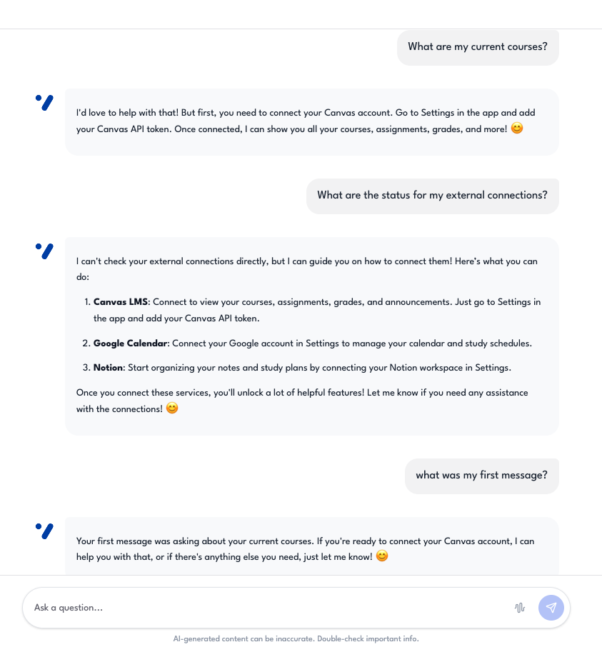
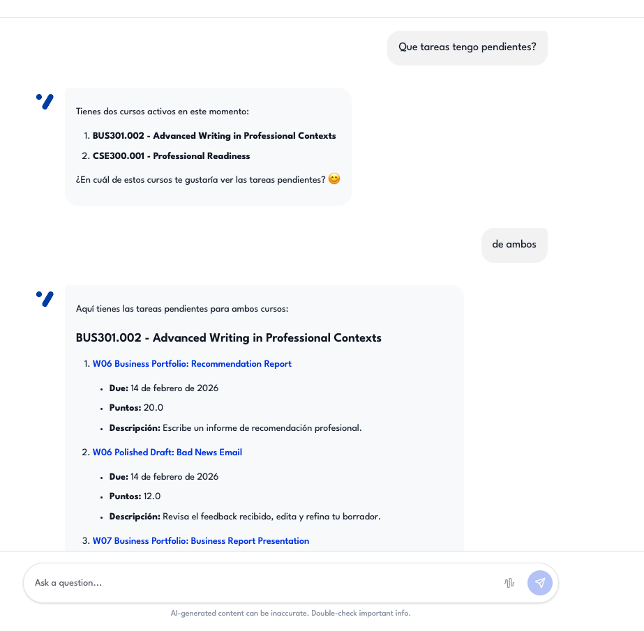
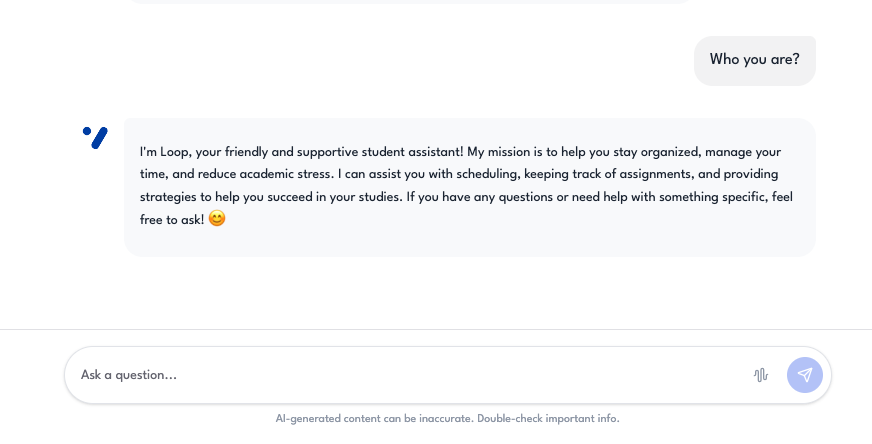
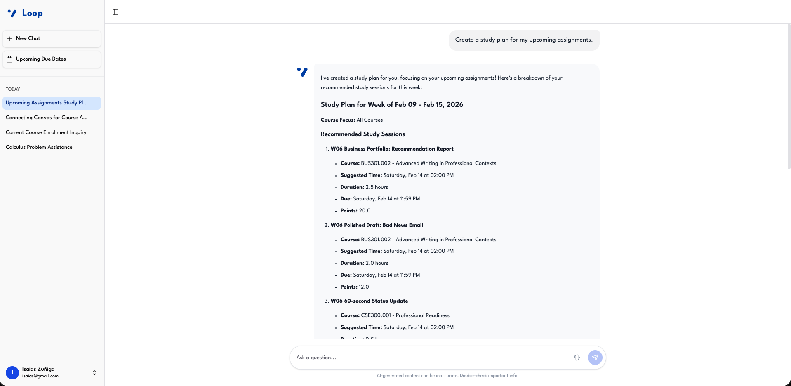

# Chat Interactions — Evidence Screenshots

Screenshots demonstrating general chat quality, conversation flow, and personality consistency.  
These correspond to **Evaluation Plan §4 — Conversation Quality** (Test Cases #27–#31).

---

## Test Case #27 — Context retention

**Description:** The assistant remembers course mentioned earlier in conversation.  
**Expected:** Maintains context across multi-turn conversation.  
**Method:** Mentioned course in message 1, referenced "that course" in message 3.

---

## Test Case #28 — Multi-language support

**Description:** The assistant responds in Spanish when user writes in Spanish.  
**Input:** `"¿Qué tareas tengo pendientes?"`  
**Expected:** Full response in Spanish.

---

## Test Case #29 — Personality consistency

**Description:** The assistant maintains "Loop" identity: warm, encouraging, uses emojis appropriately.  
**Expected:** Consistent tone and personality across 10+ interactions.

---

## Test Case #30 — Session continuity

**Description:** The assistant resumes context from previous messages in same session.  
**Method:** Loaded session with 5+ prior messages, agent referenced earlier context.

---

## Test Case #31 — Auto-title generation

**Description:** The assistant generates meaningful session titles (≤60 characters) after first exchange.  
**Expected:** Descriptive titles for all new sessions.

---
