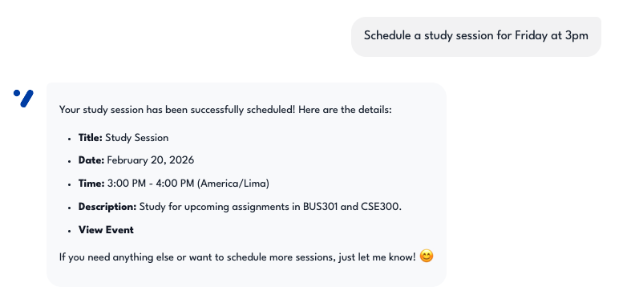
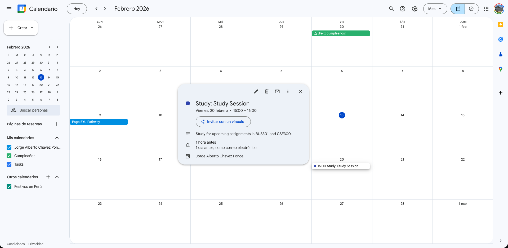
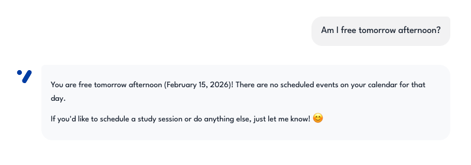
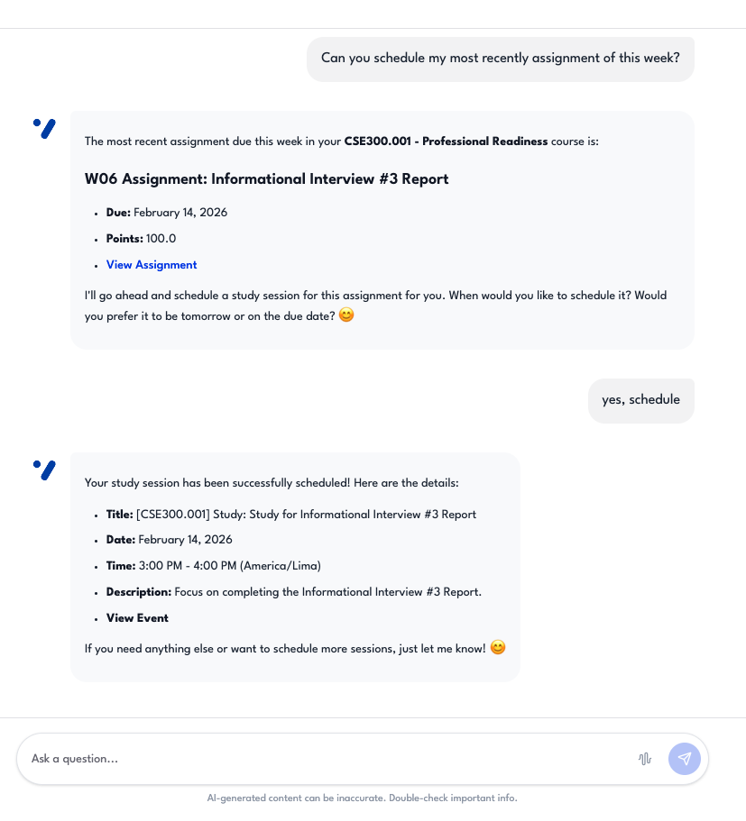
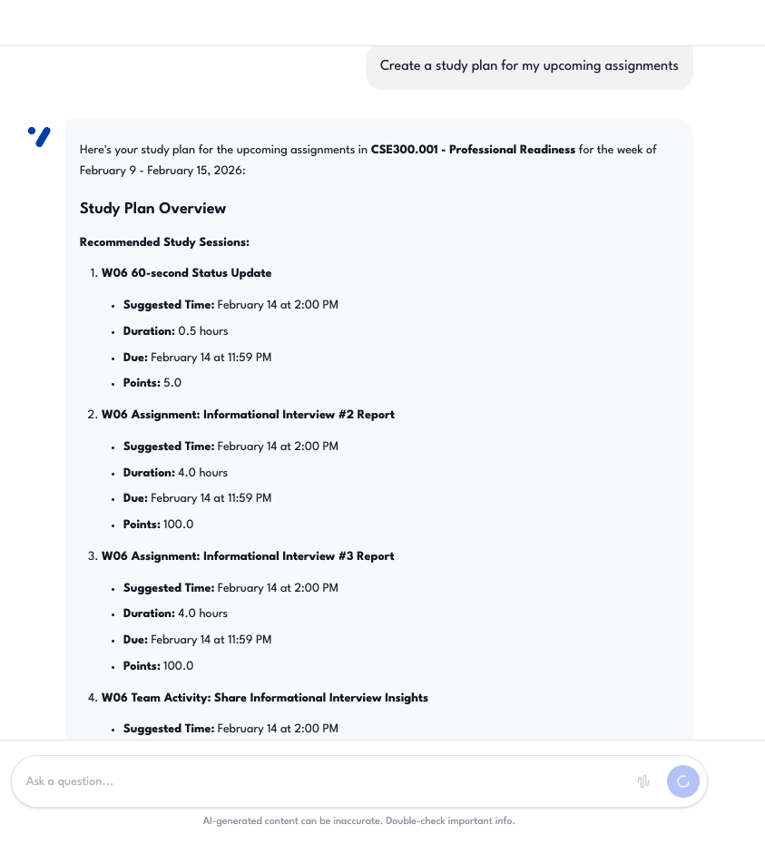
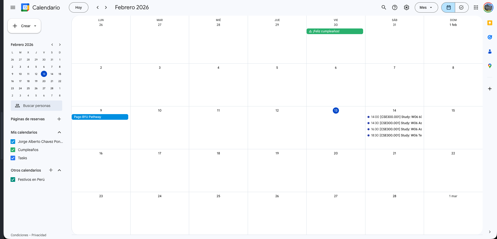
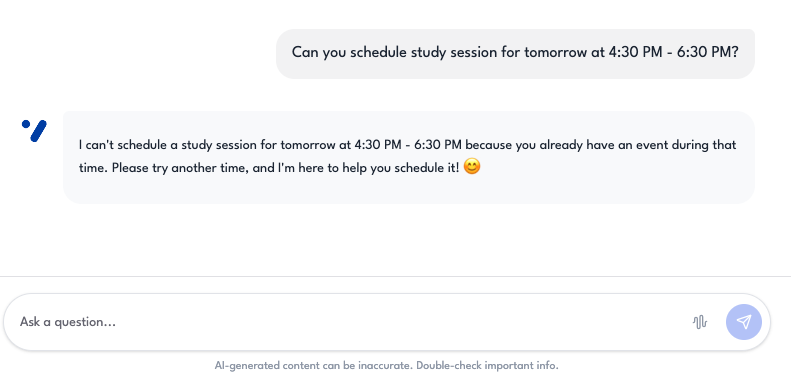
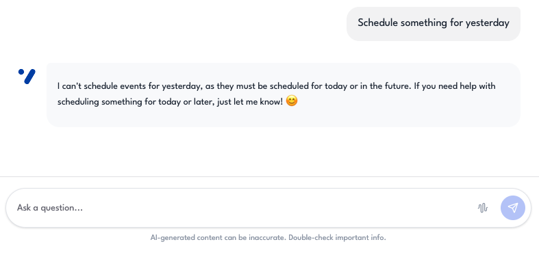

# Google Calendar — Evidence Screenshots

Screenshots demonstrating the Google Calendar integration.  
These correspond to **Evaluation Plan §1.2 — Calendar & Study Planning** (Test Cases #8–#14).

---

## Test Case #8 — Create study session

**Description:** The assistant creates a Google Calendar event for a study session.  
**Input:** `"Schedule a study session for Friday at 3pm"`  
**Expected:** Creates Google Calendar event.

---

## Test Case #9 — Check availability

**Description:** The assistant returns available time slots from the user's calendar.  
**Input:** `"Am I free tomorrow afternoon?"`  
**Expected:** Returns available time slots.

---

## Test Case #10 — Auto-reminders

**Description:** Events are created with automatic reminders (24h and 1h before).  
**Input:** Create any event.  
**Expected:** Auto-adds 24h + 1h popup reminders.

---

## Test Case #11 — Timezone detection

**Description:** The assistant uses the user's Google Calendar timezone automatically.  
**Input:** Schedule event without specifying timezone.  
**Expected:** Uses user's Google Calendar timezone.

---

## Test Case #12 — Study plan generation

**Description:** The assistant generates a multi-day study plan with multiple calendar events.  
**Input:** `"Create a study plan for my exam next Friday"`  
**Expected:** Generates multi-day plan with sessions.

---

## Test Case #13 — Conflict detection

**Description:** The assistant warns about scheduling conflicts with existing events.  
**Input:** Schedule during an existing event.  
**Expected:** Warns about conflict.

---

## Test Case #14 — Past date prevention

**Description:** The assistant rejects attempts to schedule events in the past.  
**Input:** `"Schedule something for yesterday"`  
**Expected:** Rejects with explanation.

