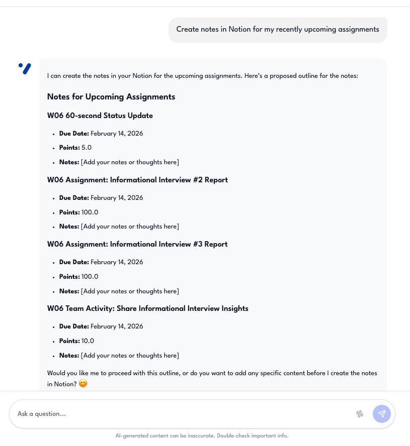
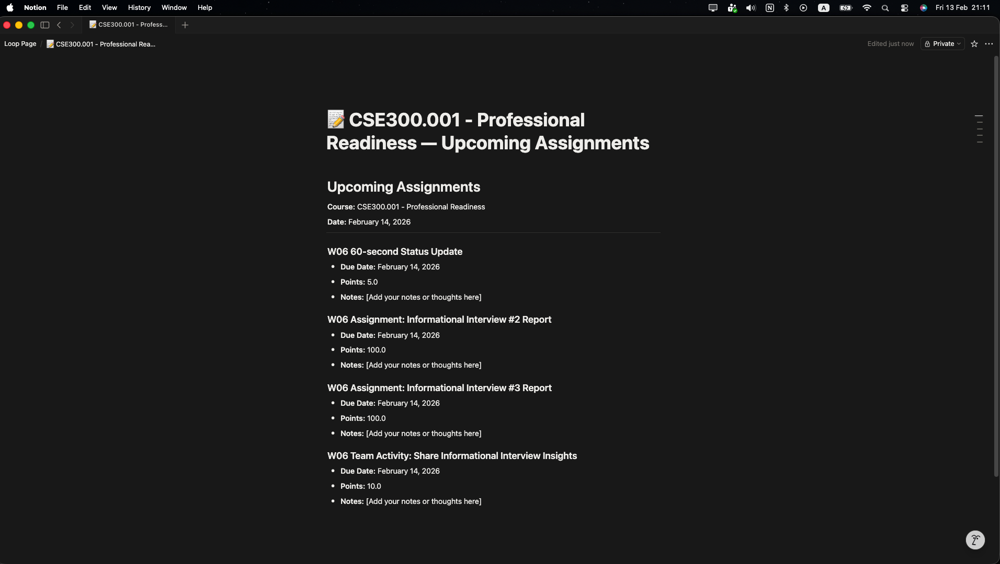
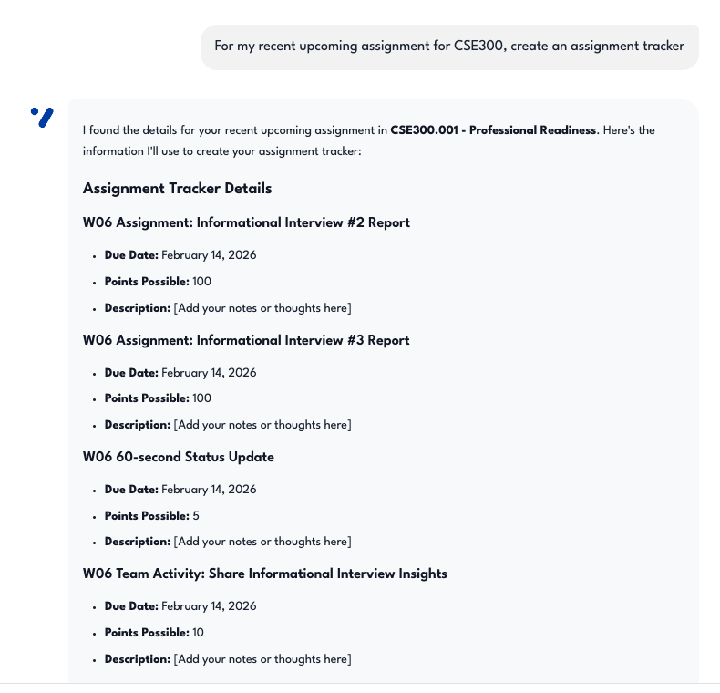
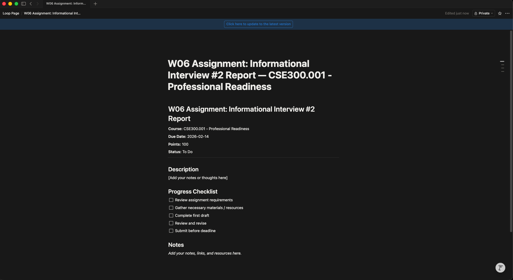
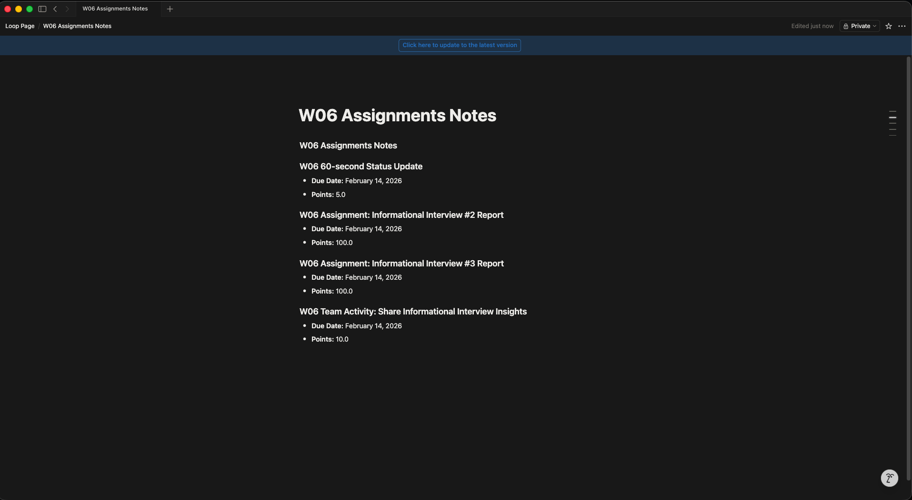
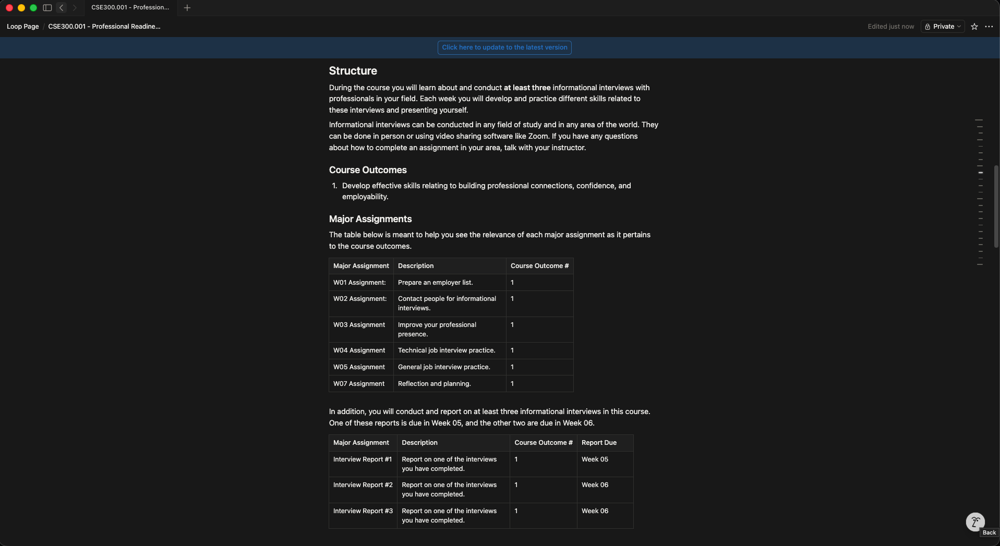
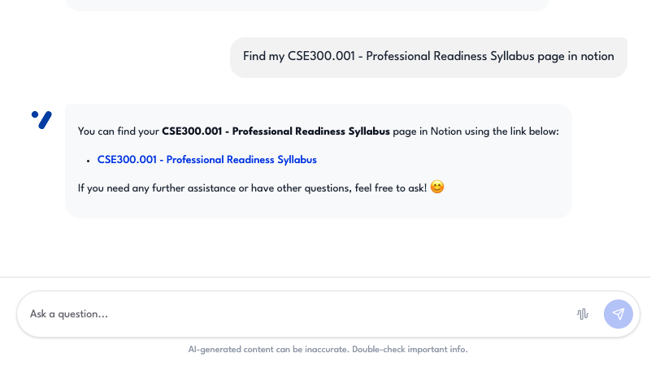

# Notion — Evidence Screenshots

Screenshots demonstrating the Notion integration.  
These correspond to **Evaluation Plan §1.3 — Notion Integration** (Test Cases #15–#19).

---

## Test Case #15 — Create study notes

**Description:** The assistant creates a formatted Notion page with study notes.  
**Input:** `"Create notes for ...."`  
**Expected:** Creates formatted Notion page.

---

## Test Case #16 — Assignment tracker

**Description:** The assistant creates a tracker page with columns for due dates, status, and priority.  
**Input:** `"Create an assignment tracker"`  
**Expected:** Creates table with due dates, status columns.

---

## Test Case #17 — Parent page selection

**Description:** The assistant creates a page under the correct parent page specified by the user.  
**Input:** `"Save notes to my Studies page"`  
**Expected:** Creates page under correct parent.

---

## Test Case #18 — Markdown rendering

**Description:** Content with headers, lists, tables, bold, and dividers renders correctly in Notion.  
**Input:** Notes with headers, lists, tables.  
**Expected:** Properly rendered in Notion (h1/h2/h3, bullets, numbered lists, tables, dividers, bold).

---

## Test Case #19 — Search pages

**Description:** The assistant returns matching Notion pages based on a search query.  
**Input:** `"Find my calculus notes"`  
**Expected:** Returns matching Notion pages.

