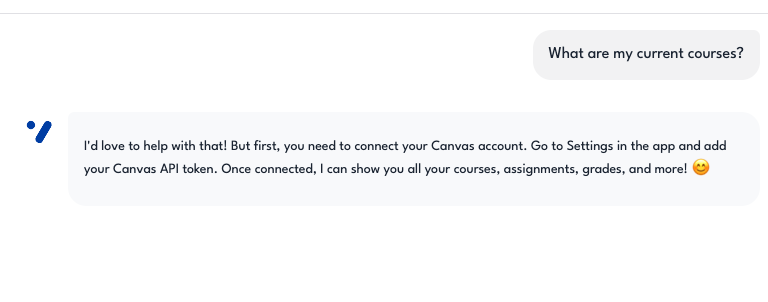
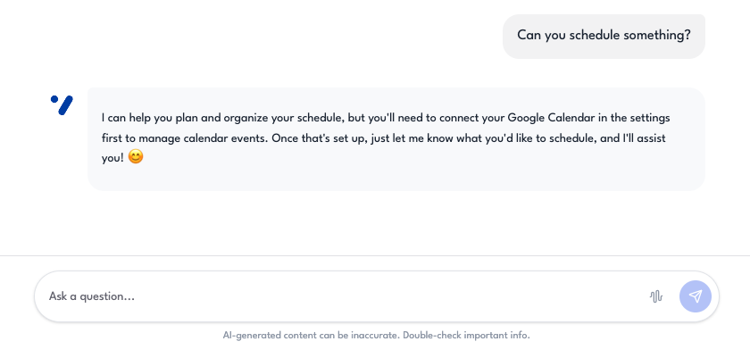
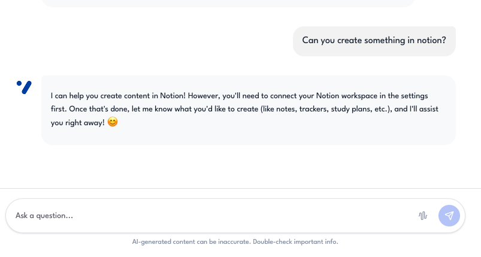
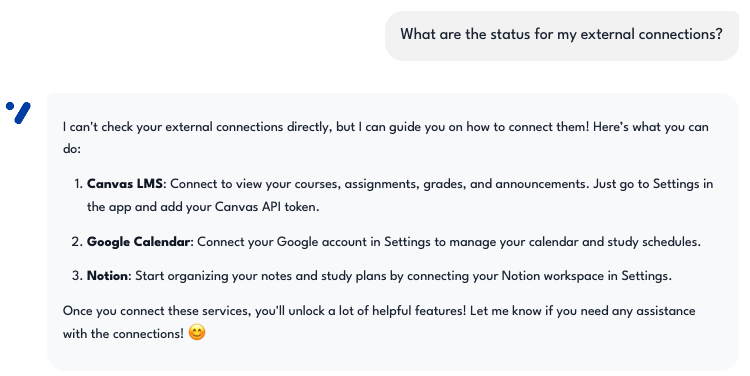
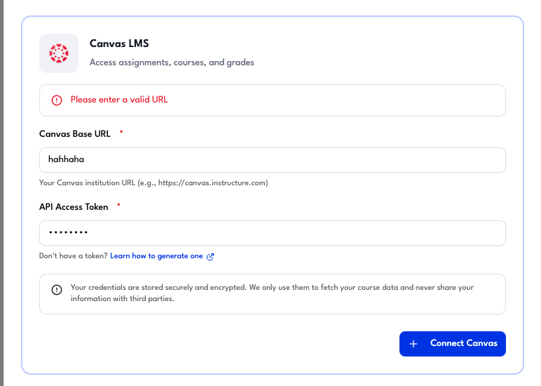
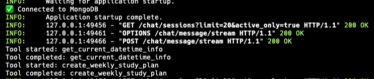

# Settings & Integration Reliability — Evidence Screenshots

Screenshots demonstrating user settings and integration error handling.  
These correspond to **Evaluation Plan §3 — Integration Reliability** (Test Cases #20–#26).

---

## Test Case #20 — Canvas token expired

**Description:** The system returns a user-friendly error and suggests reconnecting in Settings.  
**Input:** Revoke Canvas token, then query courses.  
**Expected:** Graceful error message, suggest reconnecting.

---

## Test Case #21 — Google token expired

**Description:** The system auto-refreshes the token and retries the operation.  
**Input:** Wait for Google token expiry, then schedule an event.  
**Expected:** Auto-refresh, retry the operation.

---

## Test Case #22 — Notion disconnected

**Description:** The agent operates without Notion tools and suggests connecting.  
**Input:** Delete Notion token, then ask for notes.  
**Expected:** Agent operates without Notion tools, suggests connecting.

---

## Test Case #23 — All integrations disconnected

**Description:** The system shows the `no_integrations` prompt with connection instructions.  
**Input:** Fresh account with no integrations.  
**Expected:** Shows `no_integrations` prompt, suggests connecting services.

---

## Test Case #24 — Canvas API rate limit

**Description:** The system retries with exponential backoff and informs the user.  
**Input:** Rapid sequential Canvas API requests.  
**Expected:** Retry with backoff, inform user of delay.

---

## Test Case #25 — Invalid Canvas base URL

**Description:** The system returns a clear validation error during Canvas setup.  
**Input:** Malformed URL in `/canvas/setup`.  
**Expected:** Clear error message during setup.

---

## Test Case #26 — Multiple concurrent tool calls

**Description:** All tool calls complete without race conditions.  
**Input:** Complex query triggering Canvas + Calendar tools simultaneously.  
**Expected:** No race conditions, all calls complete.

